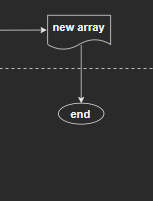
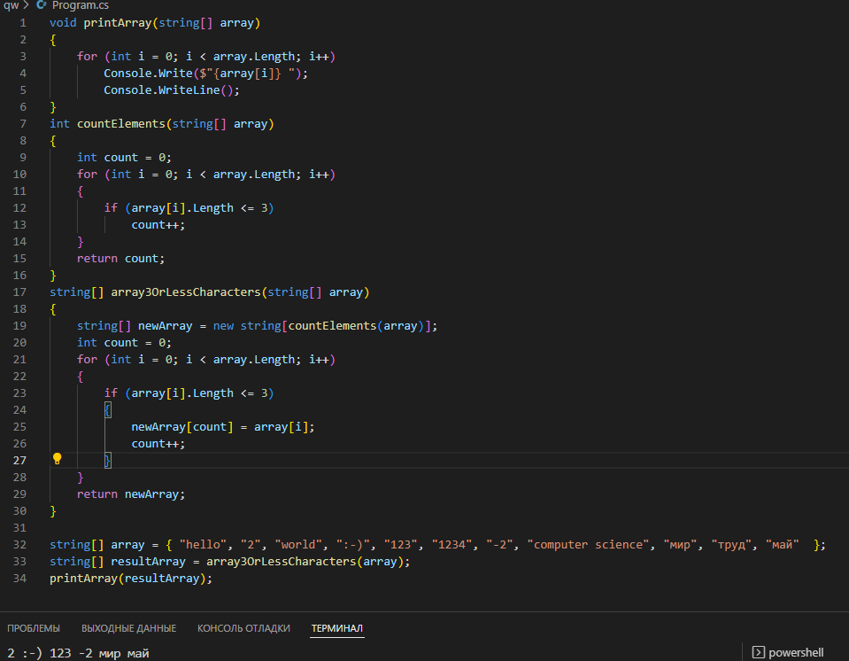

# _**Контрольная работа первая четверть**_

## *Описание*

1. Создать репозитарий Githab
2. Создать папку с контрольной в VS Code
3. Загрузить файл gitignore
4. Уточнить условия задачи
5. Проработка алгоритма
6. Выявить главный алгоритм
7. Нарисовать блок-схему
8. Написать код
9. Протестировать результат
10. Загрузить контрольную на  Githab

# Блок-схема

# Задача описание
Написать программу, которая из имеющегося массива строк формирует массив из строк, 
длина которых меньше либо равна 3 символа.

* заполнить массив строк текстом
* подсчитать количество элементов для конечного массива
* сформировать массив из строк, длина которых меньше либо равна 3 символа
* вывести сформированный массив

# Задача решение

void printArray(string[] array) 

{

    for (int i = 0; i < array.Length; i++)

        Console.Write($"{array[i]} ");

        Console.WriteLine();

}

int countElements(string[] array)

{

    int count = 0;

    for (int i = 0; i < array.Length; i++)

    {

        if (array[i].Length <= 3)

            count++;

    }

    return count;

}

string[] Array(string[] array)

{

    string[] newArray = new string[countElements(array)];

    int count = 0;

    for (int i = 0; i < array.Length; i++)

    {

        if (array[i].Length <= 3)

        {

            newArray[count] = array[i];

            count++;

        }

    }

    return newArray;

}

string[] array = { "hello", "2", "world", ":-)", "123", "1234", "1567", "-2", "computer science", "мир", "труд", "май"  };

string[] resultArray = Array(array);

printArray(resultArray);